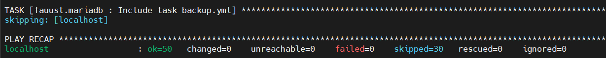

<table width="100%" border="0" cellspacing="0" cellpadding="0">
<tr>
<td align="left"><h1>Hackathon - Ynov Toulouse 2025</h1></td>
<td align="right"></td>
</tr>
</table>

> Ce repository contient les ressources ainsi que le code source développé lors du hackathon Ynov Toulouse 2025.

Cette template de README est un guide pour vous aider à structurer votre rendu de projet. N'hésitez pas à l'adapter ou surtout à le compléter avec des sections supplémentaires si nécessaire.

## Contexte

Et si on réinventait l’expérience babyfoot à Ynov ? L’objectif de ce hackathon est de moderniser et digitaliser l’usage des babyfoots présents dans le Souk pour créer un service _next-gen_, pensé pour près de 1000 étudiants !

Que ce soit via des gadgets connectés, un système de réservation intelligent, des statistiques en temps réel ou des fonctionnalités robustes pour une utilisation massive, nous cherchons des solutions innovantes qui allient créativité et technologie.

Toutes les filières sont invitées à contribuer : Dev, Data, Infra, IoT, Systèmes embarqués… chaque idée compte pour rendre le babyfoot plus fun, plus pratique et plus connecté.

Votre mission : transformer le babyfoot classique en expérience high-tech pour Ynov !

Bienvenue dans le Hackathon Ynov Toulouse 2025 !

> Retrouvez vos guidelines techniques dans le fichier [SPECIFICATIONS.md](./SPECIFICATIONS.md).

> P.S C'est un projet de groupe, pas autant de sous-projets que de filières dans votre équipe. Travaillez ensemble pour un seul et même projet au nom de votre équipe toute entière. Les guidelines sont là pour vous aider, pas pour vous diviser. Profitez de ce moment pour apprendre à travailler ensemble, partager vos compétences, et créer quelque chose d'unique.

## Equipe

- Dev' FullStack 1 : BOUCAUD Dorian
- Dev' FullStack 2 : HEUILLET Aubin
- Dev' FullStack 3 : HEUILLET Médéric
- Cloud & Infrastructure 1 : MARTIAL Quentin
- Cloud & Infrastructure 2 : AMOUSSA Hamdoune
- Cloud & Infrastructure 3 : BANCE Ousmane
- IA & Data 1 : MASSAMBA Amadou
- IA & Data 2 : THEVENET Aymeric
- IA & Data 3 : FANNY Mehita

Porte parole 
IS 
AMOUSSA Hamdoune

## Table des matières

- [Contexte](#contexte)
- [Equipe](#equipe)
- [Contenu du projet](#contenu-du-projet)
- [Technologies utilisées](#technologies-utilisées)
- [Architecture](#architecture)
- [Guide de déploiement](#guide-de-déploiement)
- [Etat des lieux](#etat-des-lieux)

## Contenu du projet

> Décrivez brièvement le projet, son objectif. Utilisez une vue business pour décrire ce que votre produit/service apporte à vos utilisateurs.

Notre projet transforme le babyfoot classique en une expérience connectée autant pour les tournois entre amis que pour les compétitions en entreprise ou en université. Les utilisateurs peuvent créer, participer à des tournois et suivre les parties en temps réel. Un tableau de bord est accessible pour les utilisateurs afin de voir les statistiques génrales tels que le nombre total de partie joué, la note moyenne des joueurs ainsi que la moyenne de la durée d'un match. L’objectif est de rendre le babyfoot plus interactif, ludique et adapté à une utilisation massive.

## Technologies utilisées

> Ici, listez les principales technologies, en expliquant pourquoi vous les avez choisies. Tout choix technique, langages, frameworks doit être justifié. (Parce que vous maîtrisez déjà la techno, parce que c'est la plus adaptée au besoin, parce que c'est la plus innovante, etc.)

# Data/IA 
- Python : Choisi pour sa simplicité, sa lisibilité et car il permet un développement rapide et collaboratif sur des datasets variés. Tous les membres du groupe Data/IA ont déjà des bases sur ce langage.

- Pandas : Utilisé pour le nettoyage et la manipulation des données tabulaires. Il permet de gérer facilement les valeurs manquantes et les doublons.

- NumPy : Utilisé pour les calculs numériques et les opérations matricielles.

- Matplotlib : Permet de visualiser les tendances et les distributions de données de manière claire et flexible. Les graphiques sont essentiels pour l’analyse exploratoire (EDA).

- Scikit-learn : Utilisé pour créer des modèles simples de prédiction. C’est une bibliothèque robuste et bien documentée, adaptée aux prototypes rapides comme pour un hackathon.

## Architecture

- Schéma réseau 

- Détails des composants :
  - Serveurs :
        - Suuuuuper_tournoi, 172.17.2.10, debian 13
        - Suuuuuper_replicat, 172.17.2.11, debian 13
   Réseau :
        - vmbr0 : 137.0.0.1/32 
        - vmbr1 : 172.17.2.0/29
  - Services : Docker, portainer, Mariadb, web
  - failover : 

## Guide de déploiement

- Copie du contenu de .ansible 
- ajout de la machine cible dans `inventory.yml`
- depuis le venv ansible lancement du playbook `ansible-playbook playbook_deploy.yml --ask-become-password`
- resultats : 

## Etat des lieux

> Section d'honnêteté, décrivez ce qui n'a pas été fait, ce qui aurait pu être amélioré, les limitations de votre solution actuelle. Montrez que vous avez une vision critique de votre travail, de ce qui a été accompli durant ces deux demi-journées.

Le but n'est pas de faire un produit fini, mais de montrer vos compétences techniques, votre capacité à travailler en équipe, à gérer un projet, et à livrer quelque chose de fonctionnel dans un temps limité.

L'intégration des modèles IA dans le site n'a pas été faite par manque de temps. Nous avons prioriser l'intégration des données néttoyées. La collaboration avec l'équipe pour la base de données s'est correctement déroulé tout au long du projet. Une amélioration serait de présenter une analyse graphique complète directement accessible depuis l'application web. 
