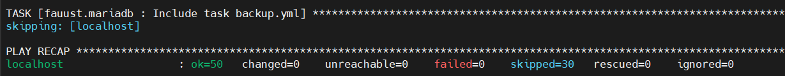

# Hackathon - Ynov Toulouse 2025 : Babyfoot du futur - Cloud & Infrastructure

## Equipe

- Cloud & Infrastructure 1 : MARTIAL Quentin
- Cloud & Infrastructure 2 : AMOUSSA Hamdoune
- Cloud & Infrastructure 3 : BANCE Ousmane

Et si on réinventait l’expérience babyfoot à Ynov ? L’objectif de ce hackathon est de moderniser et digitaliser l’usage des babyfoots présents dans le Souk pour créer un service _next-gen_, pensé pour près de 1000 étudiants !

Que ce soit via des gadgets connectés, un système de réservation intelligent, des statistiques en temps réel ou des fonctionnalités robustes pour une utilisation massive, nous cherchons des solutions innovantes qui allient créativité et technologie.

Toutes les filières sont invitées à contribuer : Dev, Data, Infra, IoT, Systèmes embarqués… chaque idée compte pour rendre le babyfoot plus fun, plus pratique et plus connecté.

Votre mission : transformer le babyfoot classique en expérience high-tech pour Ynov !

---

> Ce fichier contient les informations spécifiques au Cloud & Infra de votre projet. Il suffit d'en remplir une seule fois, même si vous êtes plusieurs Cloud & Infra dans l'équipe.

# Requis

## Architecture mise en place

- Schéma réseau 

- Détails des composants :
  - Serveurs :
        - Suuuuuper_tournoi, 172.17.2.10, debian 13
        - Suuuuuper_replicat, 172.17.2.11, debian 13
   Réseau :
        - vmbr0 : 137.0.0.1/32 
        - vmbr1 : 172.17.2.0/29
  - Services : Docker, portainer, Mariadb, web
  - failover : 

---

## Réalisations techniques
Action principales : 
 ### Automatisation 
 l'automatisation est faite via ansible et les roles ansible, c'est pour des raisons de simplicité de déploiement et de temps de mise en place. 
 En effet, D'autres solutions auraient été possible : puppet par exemple, mais les autres orchestrateurs de configuration nécessitent une installation plus longue (cluster plus agent sur les machines cible) à l'inverse Ansible nécessite uniquement un accès SSH sur la machine cible.
 Les roles utilisés : 
                        - pip
                        - docker
                        - portianer
                        - maradb
 ### Sécurité 
    - VPN wiregard pour la connexion au portainer de la part des DEV 
 ### Monitoring

---

## Déploiement
- Copie du contenu de .ansible 
- ajout de la machine cible dans `inventory.yml`
- depuis le venv ansible lancement du playbook `ansible-playbook playbook_deploy.yml --ask-become-password`
- resultats : 

---

## Bilan et perspectives
- Résumé des objectifs :
- Améliorations prévues : monitoring Prometheus, automatisation complète, sauvegardes externalisées.

---
